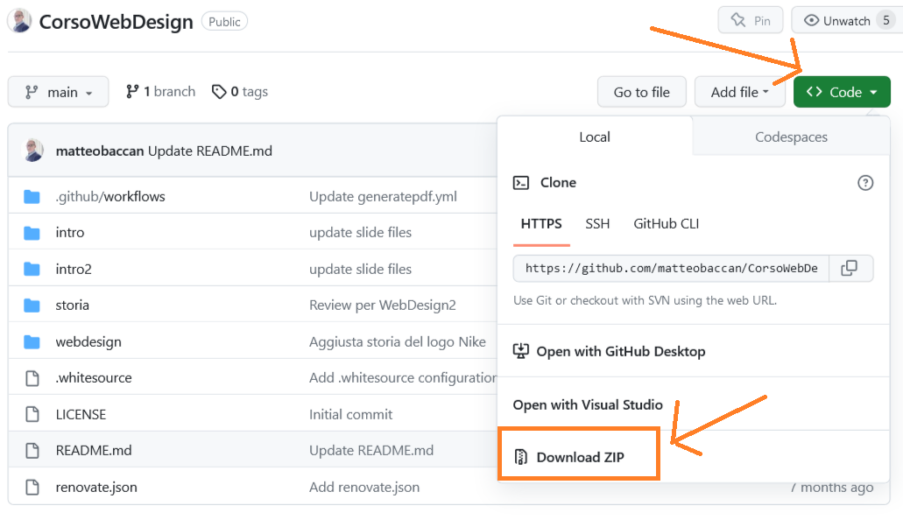

# WebDesign

Questo progetto contiene un elenco di altri progetti dedicati a singoli argomenti.

Ho utilizzato queste slide sia per raccogliere le informazioni che ricevevo durante la frequentazione di corsi, sia come materiale usato per l'insegnamento.

Il materiale arriva da internet, da portali di riferimento, da testi scritti da me o da presi da siti web specializzati: sempre citando la fonte, in modo sia possibile approfondire i singoli argomenti trattati.

## Corso di WebDesign

- [Argomenti del corso e materiale da produrre per l'esame](https://github.com/matteobaccan/CorsoWebDesign/blob/main/intro/intro.pdf)
- [Corso HTML](https://github.com/matteobaccan/CorsoHTML)
- [Corso CSS](https://github.com/matteobaccan/CorsoCSS)
- [Corso Javascript](https://github.com/matteobaccan/CorsoJavascript)
- [Corso AI](https://github.com/matteobaccan/CorsoAI)

### Progetti di esempio del corso di WebDesign

- [Integrazione Github Netlify : progetto a singola pagina per WebDesign](https://github.com/matteobaccan/github-netlify-boilerplate)

### Esercizi di WebDesign

- [ACME-2022-2023-WebDesign](https://github.com/matteobaccan/ACME-2022-2023-WebDesign)

## Corso di WebDesign2 - Strumenti di sviluppo

- [Argomenti del corso e materiale da produrre per l'esame](https://github.com/matteobaccan/CorsoWebDesign/blob/main/intro2/intro2.pdf)
- [Corso UX](https://github.com/matteobaccan/CorsoUX)
- [Corso AI](https://github.com/matteobaccan/CorsoAI)
- [Corso Online IDE](https://github.com/matteobaccan/CorsoOnlineIDE)
- [Corso jQuery](https://github.com/matteobaccan/CorsojQuery)
- [Corso SASS](https://github.com/matteobaccan/CorsoSASS)

### Progetti di esempio del corso di WebDesign2

- [Integrazione Github Netlify : progetto e-commerce per WebDesign2](https://github.com/matteobaccan/ProgettoEcommerce)

### Esercizi di WebDesign2

- [ACME-2022-2023-WebDesign2](https://github.com/matteobaccan/ACME-2022-2023-WebDesign2)

## Cosa consegnare alla commissione

La segreteria richiede una copia del vostro lavoro da poter conservare.

Durante l'anno, tutti i nostri progetti sono stati messi su progetti GitHub. Questo è un vantaggio perché GitHub permette di ottenerne facilmente una copia.

Per questa ragione il modo migliore per consegnare il materiale in segreteria è il seguente:

- Stampare la presentazione che porterete all'esame.
- Salvare su un CD/Pennetta USB, sia il PDF della presentazione che lo ZIP del progetto.

Per ottenere lo ZIP del progetto potete fare riferimento a GitHub:

- Andare sul progetto GitHub: in alto a destra c'è il pulsante "Code".
- Una volta premuto il pulsante apparirà un menù con la voce: "Download ZIP".
- Cliccando su quella voce verrà scaricata una copia esatta del vostro lavoro.

A titolo di esempio riporto la posizione del pulsante "Code" e del menù che appare dopo averlo premuto sul progetto CorsoWebDesign, chiaramente ognuno dovrà farlo sul proprio progetto:

## Chiarimento da parte della segreteria

Tutti i lavori depositati devono contenere i dati minimi per l'identificazione, quali:

- Anno accademico
- Nome dello studente
- Numero di matricola
- Docente e insegnamento
- Numero progetto/esercitazione e breve descrizione

Ricordate quindi di indicare queste informazioni, arricchendo il README.md del progetto e riportando i dati nella cover del CD/Pennetta USB.
