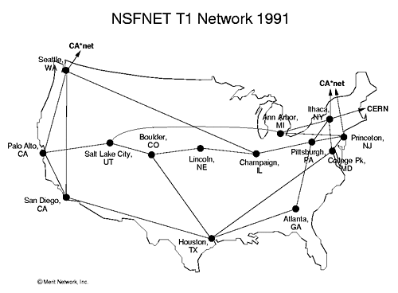

# Storia del WebDesign

Breve introduzione alla creazione di Internet all'evoluzione di HTML


<!-- _paginate: false -->
<!-- _footer: "" -->
<!-- style: "
img[alt~='center'] {
  display: block;
  margin: 0 auto;
}
" -->

---

## Di cosa parleremo

Storia di internet: come si è evoluta la rete e quali sono i vantaggi che ha portato

Evoluzione di HTML: come è nato e si è evoluto

---

## Internet History

Le slide seguenti provengono dalle slide del libro: “Computer Networking: a Top Down Approach” e sono state tradotte in italiano dall'autore di queste slide.

<https://gaia.cs.umass.edu/kurose_ross/ppt.php>

---

## 1961-1972: Principi iniziali di commutazione di pacchetto (packet-switching)

1961: Leonard Kleinrock - la teoria delle code dimostra l'efficacia della commutazione di pacchetto
1964: Paul Baran - commutazione di pacchetto nelle reti militari
1967: ARPAnet concepito dall'Advanced Research Projects Agency (ARPA)
1969: primo nodo ARPAnet operativo

1972: Demo pubblica di ARPAnet
NCP (Network Control Protocol) primo protocollo host-host
Primo programma di posta elettronica
ARPAnet ha 15 nodi

---

## 1972-1980: Interconnessione, nuove reti proprietarie

1970: Rete satellitare ALOHAnet alle Hawaii
1974: Vinton Cerf e Robert Kahn - architettura per l'interconnessione di reti
1976: Ethernet presso Xerox PARC
fine anni '70: architetture proprietarie: DECnet, SNA, XNA
1979: ARPAnet ha 200 nodi

Principi di interconnessione di Cerf e Kahn

```text
- minimalismo, autonomia - nessuna modifica interna richiesta per interconnettere le reti
- modello di servizio best-effort
- instradamento senza stato (stateless routing)
- controllo decentralizzato

definiscono l'architettura Internet odierna
```

---

## 1980-1990: nuovi protocolli, proliferazione di reti

1983: implementazione di TCP/IP
1982: definito il protocollo di posta elettronica SMTP
1983: definito DNS per la traduzione dei nomi in indirizzi IP
1985: definito il protocollo FTP
1988: controllo della congestione TCP
nuove reti nazionali: CSnet, BITnet, NSFnet, Minitel
100.000 host connessi alla confederazione di reti

---

## Internet nel 1991



---

## 1990-2000: commercializzazione, il Web, nuove applicazioni

primi anni '90: ARPAnet viene dismessa
1991: NSF rimuove le restrizioni sull'uso commerciale di NSFnet (dismesso nel 1995)
primi anni '90: Web : ipertesto [Bush 1945, Ted Nelson anni '60], HTML, HTTP: Tim Berners-Lee (CERN)
1994: Mosaic, successivamente Netscape, CSS: Håkon Wium Lie (CERN-Opera)
fine anni '90: commercializzazione del Web
fine anni '90 - 2000:
più applicazioni di successo: messaggistica istantanea, condivisione di file P2P
sicurezza di rete al primo piano
circa 50 milioni di host, oltre 100 milioni di utenti
collegamenti di backbone che operano a Gbps (Gigabit al secondo)

---

## 2005-2020: scala, SDN, mobilità, cloud

- Implementazione aggressiva dell'accesso domestico a banda larga (10-100 Mbps)
- 2008: networking definito dal software (SDN)
- Aumento dell'ubiquità dell'accesso wireless ad alta velocità: 4G/5G, WiFi
- I fornitori di servizi (Google, FB, Microsoft) creano le proprie reti
- Evitare l'utilizzo dell'Internet commerciale per connettersi "vicino" all'utente finale, fornendo accesso "istantaneo" ai social media, alla ricerca, ai contenuti video, ecc.
- Le aziende eseguono i loro servizi nel "cloud" (ad esempio, Amazon Web Services, Microsoft Azure)
- Aumento degli smartphone: dispositivi mobili più numerosi rispetto ai dispositivi fissi su Internet (2017)
- Circa 18 miliardi di dispositivi collegati a Internet (2017)

---

## 2021-2023: AI

L'Intelligenza artificiale (AI) e il Machine Learning (ML) hanno avuto un impatto significativo su Internet negli ultimi anni. Le tecnologie di intelligenza artificiale vengono utilizzate in una vasta gamma di applicazioni, come assistenti virtuali, riconoscimento vocale, raccomandazioni personalizzate e automazione dei processi aziendali.

Sicurezza informatica avanzata: Con l'aumento delle minacce alla sicurezza informatica, la protezione dei dati e della privacy è diventata una priorità sempre maggiore. Sono state sviluppate nuove tecnologie e pratiche per migliorare la sicurezza su Internet, come crittografia avanzata, autenticazione a due fattori e soluzioni di sicurezza basate sull'intelligenza artificiale.

---

## Evoluzione di HTML

Le slide seguenti provengono dalle specifiche ufficiali e sono state tradotte in italiano dall'autore di queste slide.

<https://html.spec.whatwg.org>

---

## 1990-1995

Per i suoi primi cinque anni (1990-1995), HTML ha subito diverse revisioni ed estensioni, principalmente ospitate prima presso il CERN e poi presso l'IETF.

Con la creazione del W3C, lo sviluppo di HTML è cambiato ancora una volta. Un primo tentativo fallito di estendere HTML nel 1995, noto come HTML 3.0, ha poi lasciato spazio a un approccio più pragmatico conosciuto come HTML 3.2, completato nel 1997. HTML4 è stato successivamente rilasciato nello stesso anno.

HTML - HyperText Markup Language
CERN - Organizzazione europea per la ricerca nucleare, Ginevra (Conseil Européen pour la Recherche Nucléaire)
IETF - Internet Engineering Task Force (pubblica RFC)
RFC - Richiesta di commenti
W3C - World Wide Web Consortium

---

## 1996

L'anno successivo, i membri del W3C decisero di smettere di sviluppare HTML e iniziarono invece a lavorare su un equivalente basato su XML, chiamato XHTML. Questo sforzo iniziò con una riformulazione di HTML4 in XML, nota come XHTML 1.0, che non aggiunse nuove funzionalità tranne la nuova serializzazione e che fu completata nel 2000.

Dopo XHTML 1.0, l'attenzione del W3C si concentrò nel rendere più facile per altri gruppi di lavoro estendere XHTML, sotto il nome di Modularizzazione XHTML. Parallelamente a ciò, il W3C lavorò anche su un nuovo linguaggio che non era compatibile con i precedenti linguaggi HTML e XHTML, chiamandolo XHTML2.

XHTML - eXtensible HyperText Markup Language (Linguaggio di markup ipertestuale estensibile)
XML - eXtensible Markup Language (Linguaggio di markup estensibile)

---

## 1998

Intorno al momento in cui l'evoluzione di HTML fu interrotta nel 1998, alcune parti dell'API per HTML sviluppate dai fornitori di browser furono specificate e pubblicate con il nome di DOM Level 1 (nel 1998) e DOM Level 2 Core e DOM Level 2 HTML (a partire dal 2000 e culminando nel 2003). Questi sforzi poi si affievolirono, con alcune specifiche del DOM Level 3 pubblicate nel 2004, ma il gruppo di lavoro venne chiuso prima che tutti i bozze del Level 3 fossero completate.

API - Application programming interface (Interfaccia di programmazione delle applicazioni)
DOM - Document Object Model (Modello ad oggetti del documento)

---

## 2003

Nel 2003, la pubblicazione di XForms, una tecnologia che era posizionata come la prossima generazione di moduli web, ha suscitato un rinnovato interesse nell'evoluzione di HTML stesso, piuttosto che nella ricerca di sostituti. Questo interesse è nato dalla consapevolezza che l'implementazione di XML come tecnologia web era limitata a nuove tecnologie completamente separate (come RSS e successivamente Atom), anziché come sostituto delle tecnologie web esistenti (come HTML).

XFORMS - Extensible Markup Language Forms (Moduli di linguaggio di markup estensibile)
RSS - Really Simple Syndication (Sindacazione davvero semplice)

---

## HTML4

Una prova concettuale per dimostrare che era possibile estendere i moduli di HTML4 per fornire molte delle funzionalità introdotte da XForms 1.0, senza richiedere ai browser di implementare motori di rendering incompatibili con le pagine web HTML esistenti, è stato il primo risultato di questo rinnovato interesse. In questa fase iniziale, sebbene la bozza fosse già disponibile pubblicamente e si stesse già cercando input da tutte le fonti, la specifica era ancora sotto il copyright di Opera Software.

---

## 2004

L'idea di riaprire l'evoluzione di HTML è stata testata in un workshop del W3C nel 2004, dove alcuni dei principi alla base del lavoro su HTML5 (descritti di seguito), così come la precedente proposta di bozza che copriva solo le funzionalità relative ai moduli, sono state presentate congiuntamente al W3C da Mozilla e Opera. La proposta è stata respinta perché in conflitto con la direzione precedentemente scelta per l'evoluzione del web; lo staff e i membri del W3C hanno votato per continuare a sviluppare sostituti basati su XML invece di HTML5.

---

## don't break the web

Poco dopo, Apple, Mozilla e Opera annunciarono congiuntamente la loro intenzione di continuare a lavorare all'iniziativa sotto l'egida di un nuovo ente chiamato WHATWG. Fu creato un elenco di posta pubblica e la bozza fu spostata sul sito del WHATWG. Successivamente, il copyright fu modificato per essere di proprietà congiunta dei tre fornitori e consentire il riutilizzo della specifica.

WHATWG - Web Hypertext Application Technology Working Group

---

## Retrocompatibilità

Il WHATWG si basava su diversi principi fondamentali, in particolare che le tecnologie devono essere retrocompatibili, che le specifiche e le implementazioni devono corrispondere anche se ciò comporta modificare la specifica anziché le implementazioni e che le specifiche devono essere sufficientemente dettagliate affinché le implementazioni possano raggiungere una completa interoperabilità senza doversi analizzare reciprocamente.

Quest'ultimo requisito richiedeva in particolare che il campo di applicazione della specifica HTML5 includesse ciò che era stato precedentemente specificato in tre documenti separati: HTML4, XHTML1 e DOM2 HTML. Significava anche includere significativamente più dettagli rispetto a quanto considerato normale in precedenza.

---

## 2006

Nel 2006, il W3C manifestò interesse a partecipare allo sviluppo di HTML5 e nel 2007 formò un gruppo di lavoro incaricato di collaborare con il WHATWG nello sviluppo della specifica HTML5. Apple, Mozilla e Opera permisero al W3C di pubblicare la specifica con il copyright del W3C, mantenendo però una versione con una licenza meno restrittiva sul sito del WHATWG.

---

## 2011

Per diversi anni, i due gruppi hanno lavorato insieme. Nel 2011, tuttavia, i gruppi giunsero alla conclusione che avevano obiettivi diversi: il W3C voleva pubblicare una versione "finita" di "HTML5", mentre il WHATWG voleva continuare a lavorare su uno standard vivente per HTML, mantenendo continuamente la specifica anziché congelarla in uno stato con problemi noti e aggiungendo nuove funzionalità secondo necessità per far evolvere la piattaforma.

Nel 2019, il WHATWG e il W3C hanno firmato un accordo per collaborare in futuro su una singola versione di HTML.

Approfondimenti <https://it.wikipedia.org/wiki/HTML>

---

## Fonti usate per la creazione di queste slide

<https://gaia.cs.umass.edu/kurose_ross/ppt.php> : “Computer Networking: a Top Down Approach”
<https://html.spec.whatwg.org> : specifiche HTML

L'immagine di sfondo è stata generata con <https://app.haikei.app>

Ogni immagine inserita riporta la fonte

---

## Riferimenti

Per approfondimenti fare riferimento al sito dell'autore [baccan.it](https://www.baccan.it) o al suo profilo [GitHub](https://github.com/matteobaccan)

---

## Disclaimer

L'autore ha generato questo testo in parte con GPT-3, il modello di generazione del linguaggio su larga scala di OpenAI. Dopo aver generato la bozza della lingua, l'autore ha rivisto, modificato e rivisto la lingua a proprio piacimento e si assume la responsabilità  ultima del contenuto di questa pubblicazione.
