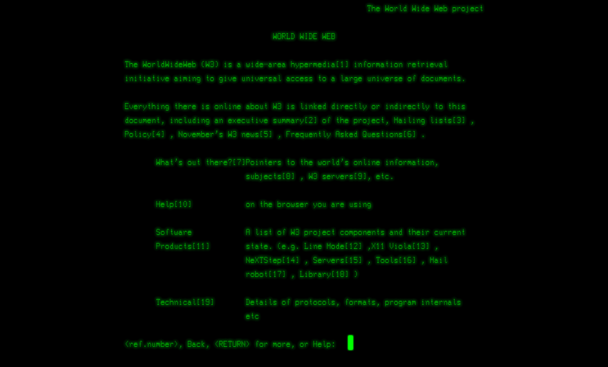
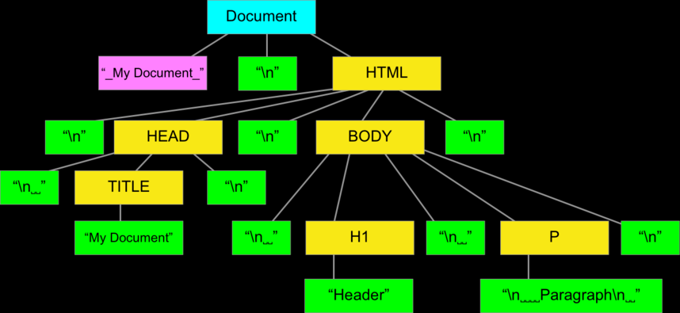

# Corso WebDesign

Lo sviluppo web

<!-- _paginate: false -->
<!-- _footer: "" -->
<!-- style: "
img[alt~='center'] {
  display: block;
  margin: 0 auto;
}
" -->

---

## Web come standard

Il Web rappresenta lo standard de facto dello sviluppo moderno

Nonostante questo continua ad essere necessario poter ancora sviluppare in modalità “desktop”

---

## Da dove siamo partiti

<http://info.cern.ch/hypertext/WWW/TheProject.html>

---

1993 Mosaic - <https://it.wikipedia.org/wiki/Mosaic>

1994 Netscape: GIF animate, formattazione dei testi e tabelle

1994 Fondazione del consorzio W3C

1995 Javascript - <https://it.wikipedia.org/wiki/JavaScript>

1996 CSS1 si affianca allo stile inline

---

2000 Flash 5 e ActionScript 1.0

2001 SVG - <https://it.wikipedia.org/wiki/Scalable_Vector_Graphics>

2003 WordPress - <https://it.wikipedia.org/wiki/WordPress>

2004 CSS Sprite

2006 Sass CSS pre-processor

2007 CSS Grid layout

2009 CSS Flex box - <https://en.wikipedia.org/wiki/CSS_Flexible_Box_Layout>

---

2010 Responsive design - <https://it.wikipedia.org/wiki/Design_responsivo>

2011 Metro/Flat design

2012 Media query

2014 WebGL per 3D

2015 Esplosione di HTML e abbandono di Flash

---

2016 Minimal Design, basic element, mobile first e thumb friendly

2018 Asymmetrical layout / Broken grid

2019
Background video
Non-traditional page-flow / Parallax scrolling
Interactive content: i siti non sono più statiche rappresentazioni, ma elementi interattivi <https://durimel.io/works/logos>
Minimalismo: “Less is more”

<https://redstapler.co/web-design-trends-2019/>
<https://redstapler.co/evolution-webdev-webdesign-1990-2019/>

---

## La storia del logo Nike

Quanto è costato il logo NIKE? 35 dollari

Phil Knight, il cofondatore di Nike insegnava contabilità alla Portland State University, sentì Carolyn Davidson dire che non poteva permettersi forniture per la pittura a olio e le chiese di lavorare per quella che allora era la Blue Ribbon Sports, Inc.
Davidson creava tabelle e grafici per i suoi incontri con i dirigenti delle calzature giapponesi per poi passare a disegnare poster, pubblicità e volantini per l'azienda.
Nel 1971, Knight e il suo co-fondatore avevano bisogno di un logo per una nuova linea di scarpe da corsa. Hanno chiesto a Davidson di disegnare una striscia (termine industriale per il logo di una scarpa) che "avesse qualcosa a che fare con il movimento".

---

Davidson ha lavorato alle sue idee disegnando su un pezzo di tessuto con sopra il disegno di una scarpa. Ha prodotto cinque diversi modelli, uno dei quali era lo Swoosh che ricorda un'ala e allude a Nike, la dea greca della vittoria.
Avendo bisogno di scegliere un logo per rispettare le scadenze di produzione incombenti, Knight ha optato per lo Swoosh dopo aver rifiutato altri quattro design di Davidson.
A quel tempo, ha dichiarato del logo: "Non lo amo, ma crescerà su di me".
Per i suoi servizi, la società le ha pagato $ 35, che, se adeguati all'inflazione per il 2018, sarebbero l'equivalente in valore di circa $ 217.
Davidson ha continuato a lavorare per Blue Ribbon Sports fino a quando le esigenze di progettazione dell'azienda in crescita hanno superato la capacità di una persona. Nel 1976, l'azienda ha assunto la sua prima agenzia pubblicitaria esterna, John Brown and Partners, e Davidson ha continuato a lavorare sulle esigenze di altri clienti.

---

Nel settembre 1983, quasi tre anni dopo la quotazione in borsa della società, Knight invitò Davidson a un ricevimento aziendale. Lì, le ha regalato swoosh di cioccolato, un anello di diamanti in oro e inciso con lo Swoosh e una busta piena di 500 azioni (stimate per un valore di $ 1.000.000 a partire dal 2015) di azioni Nike che sono state suddivise in 32.000 azioni a partire dal 2016. Del regalo, dice Davidson, "questo è stato qualcosa di piuttosto speciale da fare per Phil, perché inizialmente gli avevo fatturato e lui ha pagato quella fattura". Davidson divenne noto come "The Logo Lady". Nel 1995 Nike ha rimosso la parola "Nike" dal logo; lo Swoosh ora si distingue da solo come logo del marchio.

Davidson si è ritirata nel 2000 e ora si dedica agli hobby e al volontariato,

<https://en.wikipedia.org/wiki/Carolyn_Davidson_(graphic_designer)>

---

## Sviluppo pre-2000

Prima degli anni 2000 lo sviluppo era generalmente desktop/locale o client/server

Desktop/Locale
Applicazione e dati risiedevano su una singola macchina

---

## Client/Server

Dati e applicazione erano divisi fra client e server in modalità differenti
Applicazione locale e dati su server con gestione locale
Applicazione locale e dati su server con gestione centralizzata
Applicazione e dati su server con utilizzo di thin client

<https://it.wikipedia.org/wiki/Thin_client>

---

## Sviluppo post-2000

A partire dagli anni 90, soprattutto dopo gli anni 2000, lo sviluppo si è fortemente spostato verso le soluzioni web come evoluzione dell’approccio client/server

---

## Sviluppo post-2000 - pro

Vantaggi delle applicazioni web

Centralità
Scalabilità
Diffusione su qualsiasi tipo di device
Responsive
Resilienza
Utilizzo dentro sandbox

---

## Sviluppo post-2000 - contro

Svantaggi

Impossibilità di accesso a dati locali
Difficoltà nell’uso di apparati legacy locali
L’applicazione viene scaricata in continuazione perché non risiede sul client
Troubleshooting difficoltoso

---

## Frontend - 2000

Agli inizi degli anni 2000 il web diventa la prima piattaforma di sviluppo.

Gli strumenti necessari per realizzare un’applicazione erano

HTML
CSS
Javascript

---

## Backend - 2000

Il backend delle applicazioni si riduceva ad un numero abbastanza limitato di prodotti

Lotus Notes
Tomcat/Jboss (mondo java)
CGI Application (scritte in C/Perl/etc)

---

## Frontend - 2006

jQuery: Libreria che permette agli sviluppatori di semplificare molte operazioni Javascript

L’obiettivo era quello di scrivere meno righe di codice ed avere una miglior portabilità cross browser su aspetti come

chiamate AJAX
manipolazione del DOM

---

## AJAX

AJAX, acronimo di Asynchronous JavaScript and XML, è una tecnica di sviluppo software per la realizzazione di applicazioni web interattive (Rich Internet Application)

Si basa su uno scambio di dati in background fra web browser e server, consentendo così l'aggiornamento dinamico di una pagina web senza esplicito ricaricamento da parte dell'utente.

<https://it.wikipedia.org/wiki/AJAX>

---

## DOM

Document Object Model (abbreviato come DOM), è un modello ad oggetti del documento.

È una forma di rappresentazione dei documenti strutturati diventata lo standard ufficiale del W3C in maniera da essere neutrali sia per la lingua che per la piattaforma

<https://it.wikipedia.org/wiki/Document_Object_Model>

---

## Frontend - 2007

CSS frameworks – Permettono di standardizzare l’utilizzo dei CSS, focalizzandosi sul design e sulla UI

Bootstrap
Foundation

<https://dev.to/theme_selection/best-css-frameworks-in-2020-1jjh>

---

## Frontend - 2010

AngularJS – Un Framework che semplifica lo sviluppo delle applicazioni web dinamiche con il data binding bidirezionale per scrivere meno codice.

---

## Frontend - 2013 - 2016

React – Libreria Consente la creazione di applicazioni Web di grandi dimensioni, scalabili e veloci. Richiede l'installazione di librerie aggiuntive.

Vue - Aiuta a costruire interfacce utente e SPA (Single Page App)

Svelte - Strumento leggero per la costruzione di PWA (Progressive Web App)

---

## Frontend - SPA e PWA

SPA, acronimo di Single Page Application, è un'applicazione a pagina singola: Il browser non invia una richiesta per caricare l'intera nuova pagina quando l'utente fa clic su un collegamento, ma utilizza JavaScript (chiamate Ajax)

Strumenti per realizzare SPA sono Angular o React

---

## PWA

Una PWA è quasi sempre una SPA

PWA, acronimo si Progressive Web Application, è un'applicazione web progressiva.

PWA è un termine coniato da Google ed è più una mentalità che una tecnica.

La caratteristica più comunemente indicata, tuttavia, è l'utilizzo di service worker che rende possibile l'applicazione offline.

---

## PWA caratteristiche

Una PWA è:

Progressive - Funzionano per ogni utente a prescindere dal browser
Responsive - Si adattano alle varie dimensioni dello schermo
Indipendenti dalla connessione - I Service worker consentono di far funzionare l'applicazione offline
App-like - Si comportano con l'utente come se fossero delle app native
Aggiornate - Le informazioni sono sempre aggiornate grazie ai service worker.
Sicure - Vengono esposte su protocollo HTTPS
Discoverable - Vengono identificate come “applicazioni”
Riattivabili - Rendono facile la riattivazione grazie alle notifiche push.
Installabili - Consentono all'utente di "salvare" le app
Linkabili - Facilmente condivisibili tramite l'URL

---

Per maggiori informazioni

<https://it.wikipedia.org/wiki/Progressive_Web_App>

<https://web.dev/progressive-web-apps/>

La corretta combinazione dei principi di PWA e SPA può portare a un'esperienza utente notevolmente migliorata, specialmente sui telefoni cellulari con connessioni Internet inaffidabili.

---

## Web Builder

---

## CMS

Un CMS, acronimo di Content Management System, è uno strumento software, installato su un server web, il cui compito è facilitare la gestione dei contenuti di siti web, svincolando il webmaster da conoscenze tecniche specifiche di programmazione Web.

<https://it.wikipedia.org/wiki/Content_management_system>

---

## Fonti usate per la creazione di queste slide

L'immagine di sfondo è stata generata con <https://app.haikei.app>

Ogni immagine inserita riporta la fonte

---

## Disclaimer

L'autore ha generato questo testo in parte con GPT-3, il modello di generazione del linguaggio su larga scala di OpenAI. Dopo aver generato la bozza della lingua, l'autore ha rivisto, modificato e rivisto la lingua a proprio piacimento e si assume la responsabilità  ultima del contenuto di questa pubblicazione.
